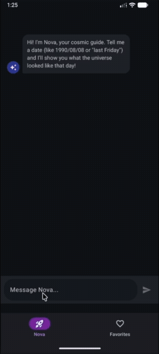
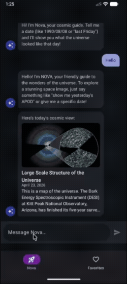
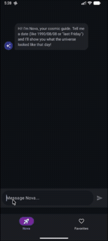
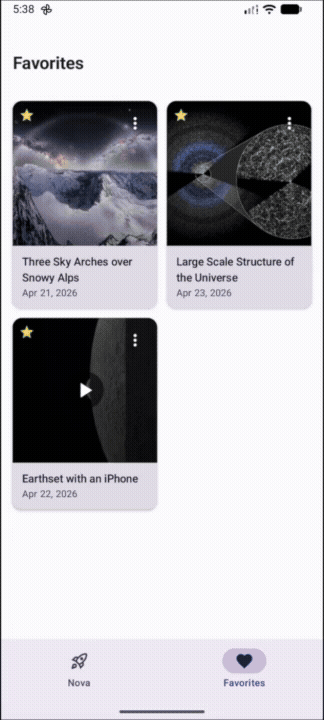

# NASA Cosmos Messenger

本專案不僅**完全達成所有核心功能與 Bonus**，更額外整合了 **Google Gemini API**，讓 AI 助理 Nova 更接近真實 ChatBot 體驗。系統底層全面採用 **Clean Architecture** 與 **MVVM** 架構，並具備離線快取、聊天室歷史保存、可測試與可擴充性。

## Demo

完整 Demo 影片：[YouTube Shorts](https://youtube.com/shorts/tE3sT8Mc3y8)

<p align="center">
  
  
  
  
</p>

## 完成項目 Check List

### 必做功能 (Core Requirements)
- [x] 聊天泡泡介面（使用者靠右、Nova 靠左）、自動平滑捲動
- [x] 長按 APOD 訊息加入收藏
- [x] NASA APOD API 整合（圖片 / 影片 / 標題 / 說明）
- [x] 日期辨識：`yyyy/MM/dd`、`yyyy-MM-dd`
- [x] 收藏 Tab：瀏覽 + 刪除

### 加分功能 (Bonus Features)
- [x] **離線存取**：Room 快取，離線仍可瀏覽歷史訊息
- [x] **分享星空卡**：點擊圖片合成「生日星空卡」並分享
- [x] **影片收藏支援**：影片 APOD 顯示 YouTube 縮圖，長按可加入收藏
- [x] **錯誤重試**：網路請求失敗時顯示 Retry 選項
- [x] **深色模式**：跟隨系統自動切換

### 額外功能 (Extra Feature)
- [x] **Gemini AI 整合**：自然語言日期辨識（「昨天」、「上禮拜五」）+ Nova AI 對話回覆


## 架構說明與選擇原因

本專案採用 **Clean Architecture + MVVM**，分為三層：

```
Presentation (UI + ViewModel) → Domain (UseCase + Repository Interface) ← Data (Repository Impl + API/DB)
```

整體資料流向：

```
UI
└─► ViewModel
      └─► UseCase
            └─► Repository Interface（Domain 定義）
                  └─► Repository Impl（Data 層）
                        ├─► [網路] Retrofit API → DTO
                        │         └─► Mapper（DTO → Domain Model）
                        └─► [本地] Room DAO → Entity
                                  └─► Mapper（Entity → Domain Model）
```

### 為什麼選擇這個架構？

1. **職責分離**：ChatBot 對話邏輯、API 請求、資料庫存取完全解耦，避免 God Class
2. **高可測試性**：Domain 層純 Kotlin，不依賴 Android Framework，TDD 開發 32 個單元測試覆蓋所有 UseCase
3. **高擴展性**：新增 Gemini API 時，只需在 Data 層新增實作，Presentation 層幾乎無需修改


## Tech Stack

| 元件 | 技術 |
|------|------|
| UI | Jetpack Compose + Material 3 |
| 狀態管理 | ViewModel + StateFlow |
| 依賴注入 | Hilt (KSP) |
| 導航 | Navigation Compose（type-safe routes）|
| 網路 | Retrofit + kotlinx.serialization |
| 資料庫 | Room（APOD 快取、收藏、聊天記錄）|
| 圖片載入 | Coil 3.x |
| 非同步 | Kotlin Coroutines + Flow |
| AI | Google Gemini API（gemini-3-flash-preview）|
| CI/CD | GitHub Actions：push `v*` tag 自動建置 Debug APK 並上傳至 GitHub Release |
| 測試 | JUnit 5 + MockK + Truth + Turbine |


## 支援的日期格式列表

### 題目要求

- `yyyy/MM/dd`，例如 `1995/06/20`
- `yyyy-MM-dd`，例如 `1995-06-20`

### 額外支援

- 自然語言日期，例如 `昨天`、`前天`、`上禮拜五`
- Gemini 會將語意日期轉成標準 `YYYY-MM-DD` 再進入既有 APOD 查詢流程

### 日期範圍

- NASA APOD 最早日期：`1995-06-16`
- 系統會自動驗證日期範圍，確保查詢結果正確

## Bonus 功能說明

### 離線存取
所有已載入的 APOD 自動寫入 Room `apod_cache` 資料表。對話記錄（`chat_messages`）與快取以 `apod_date` 關聯，重啟 App 後透過 `RestoreChatHistoryUseCase` 還原完整對話，無網路仍可瀏覽歷史訊息。

### 分享星空卡
點擊聊天或收藏中的 APOD 圖片，`BirthdayCardGenerator` 以 Canvas 將圖片與標題、日期繪製為生日星空卡（1080×1350），透過 FileProvider + 系統 Share Sheet 分享。影片類 APOD 自動導出 YouTube 縮圖，非 YouTube 來源則回退至純文字卡片。

### Gemini AI 整合說明

`ProcessChatMessageUseCase` 作為核心協調器，依序處理訊息：

1. **Regex 日期辨識** → 直接查詢 APOD
2. **Gemini 語意辨識** → 轉換日期後查詢 APOD
3. **無日期 + 首次** → 回傳今日 APOD + AI 回覆
4. **無日期 + 已傳送** → 純 AI 對話

Gemini API 透過獨立的 `GeminiModule` 注入，與 NASA API 完全解耦。

## 專案結構

```
app/src/main/java/com/example/nasacosmosmessenger/
├── di/                     # Hilt 模組（AppModule, NetworkModule, DatabaseModule, GeminiModule）
├── data/
│   ├── local/              # Room Database、DAO、Entity
│   ├── remote/             # Retrofit API 介面、DTO
│   ├── mapper/             # DTO ↔ Domain ↔ Entity 轉換
│   └── repository/         # Repository 實作
├── domain/
│   ├── model/              # 純 Kotlin Domain Model
│   ├── repository/         # Repository 介面
│   └── usecase/            # Use Cases（單一職責）
├── presentation/
│   ├── chat/               # 聊天頁面、ViewModel、Composable 元件
│   ├── favorites/          # 收藏頁面、ViewModel、Composable 元件
│   ├── common/             # 共用 UI 元件
│   ├── navigation/         # NavGraph、Route 定義
│   └── util/               # BirthdayCardGenerator
└── ui/theme/               # Color、Typography、Theme
```


## 專案設定與執行

### 開發環境需求
- Android Studio Ladybug 或更新版本
- JDK 17+

### API Key 設定
1. 請至 [api.nasa.gov](https://api.nasa.gov/) 申請 NASA API Key。
2. （選用）請至 Google AI Studio 申請 Gemini API Key。
3. 在專案根目錄建立或開啟 `local.properties` 檔案，加入以下設定：
   ```properties
   NASA_API_KEY=您的_NASA_API_KEY
   GEMINI_API_KEY=您的_GEMINI_API_KEY
   ```
   *(註：若未提供 Gemini API Key，App 仍可正常執行基本的 NASA 查詢功能，但會以預設訊息替代智能回覆；NASA_API_KEY 若使用 `DEMO_KEY` 則有每日 30 次請求限制。)*
4. Sync Gradle 並編譯執行。

